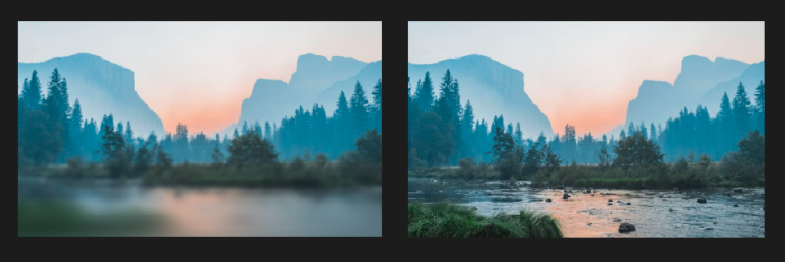
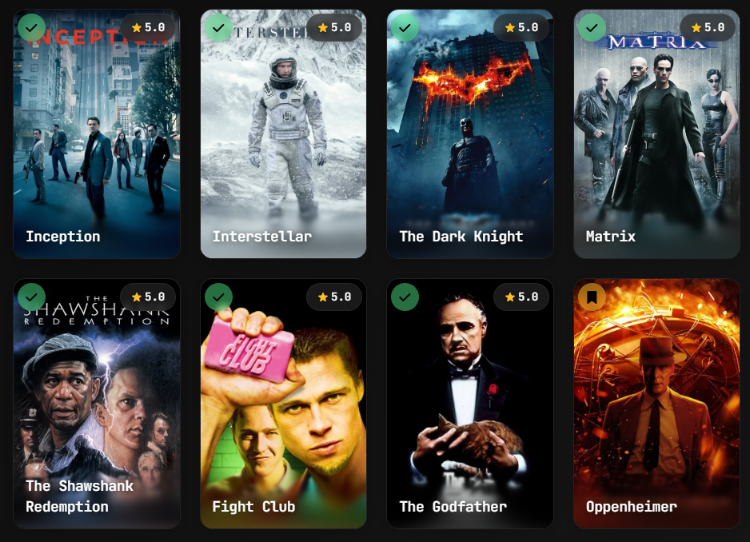
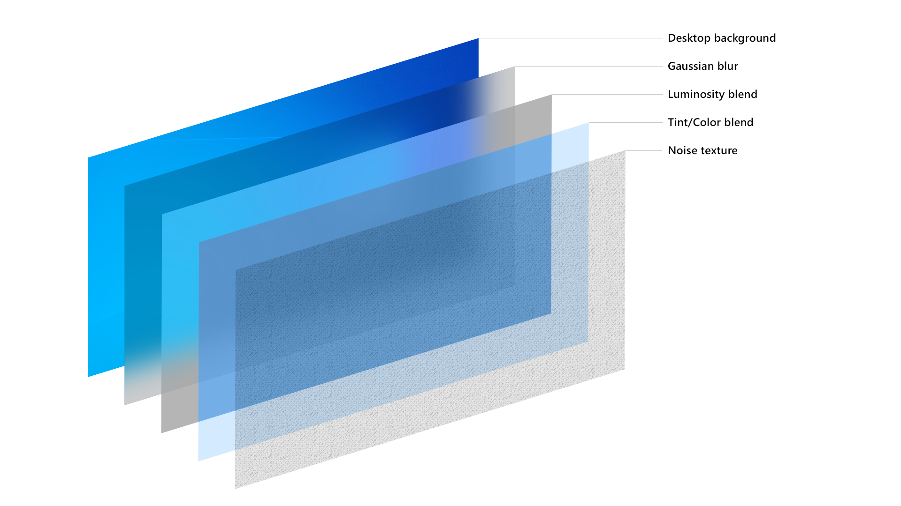

<p align="center">
  
<h1 align="center">Progressive Acrylic</h1>
</p>

🎨 **Advanced layered acrylic glass and progressive (guassian) blur effects** for web elements. Create iOS/Windows-style acrylic blur overlays with multiple customizable layers: blur, luminosity, tint, and noise.

 

## 🎯 Project Purpose

Progressive Acrylic aims to bring sophisticated acrylic glass and progressive blur effects to web interfaces, inspired by both iOS and Windows design languages. The library provides a powerful yet easy-to-use solution for creating layered blur effects that can enhance the visual hierarchy and depth of web applications.




The project focuses on:
- Creating natural, iOS-style progressive blur transitions
- Implementing Windows Acrylic material design principles
- Providing granular control over each visual layer
- Maintaining high performance through CSS optimizations


## 📖 Project Background

This project started as an iOS-style **progressive blur** implementation, inspired by projects like [Glur](https://github.com/joogps/Glur) which creates beautiful progressive blur effects in SwiftUI.

Progressive blur creates a natural feathering effect where the blur intensity gradually increases, mimicking the depth of field effect seen in iOS interfaces.


*Multiple progressive blur layers working together*

Later, the project evolved to implement **Microsoft Windows Acrylic design language**, following the official [Windows Acrylic Material guidelines](https://learn.microsoft.com/en-us/windows/apps/design/style/acrylic). The Windows acrylic system uses a sophisticated 4-layer approach that combines blur, luminosity adjustments, color tinting, and noise texture to create the distinctive frosted glass appearance.



*The Windows Acrylic layer system: Desktop background → Gaussian blur → Luminosity blend → Tint/Color blend → Noise texture*

The layer architecture directly follows Microsoft's design specifications, implementing the same background source, blur effects, exclusion blending, color tinting, and noise patterns that make Windows Acrylic so distinctive and visually appealing.

## ✨ Features

- 🔥 **4-Layer System** - Blur, Luminosity, Tint, and Noise layers
- 🎨 **Advanced Tint System** - Solid colors or linear gradients with individual opacity
- 🎯 **Custom Cubic-Bezier Curves** - Full curve customization for feathering
- 💡 **Luminosity Layer** - Brightness, contrast, saturation adjustments
- 🎪 **Noise Layer** - Grain effects like Windows Acrylic
- ⚡ **High Performance** - Uses CSS backdrop-filter and mask
- 🧩 **Unified API** - Single function handles all layers

## 🚀 Quick Start

### Installation

```bash
npm install progressive-acrylic
```

### Basic Usage

```html
<div class="image-container">
  <div class="blur-overlay" id="myBlur"></div>
</div>

<script src="./progressive-acrylic.js"></script>
<script>
  progressiveAcrylic(document.getElementById('myBlur'), {
    blur: {
      enabled: true,
      direction: 'bottom',
      height: '50%',
      maxBlur: 200
    },
    tint: {
      enabled: true,
      color: '#ffffff',
      opacity: 0.1
    }
    ...
  });
</script>
```

## 📋 API Reference

### `progressiveAcrylic(target, options)`

The main function for creating layered acrylic effects.

#### Parameters

| Parameter | Type | Default | Description |
|-----------|------|---------|-------------|
| `target` | HTMLElement | - | Target DOM element for blur overlay |
| `options` | Object | `{}` | Configuration options |

#### Options Object Structure

```javascript
{
  blur: { /* Blur layer settings */ },
  luminosity: { /* Luminosity layer settings */ },
  tint: { /* Tint layer settings */ },
  noise: { /* Noise layer settings */ }
}
```

## 🎯 Layer Configuration

### Blur Layer Options

| Option | Type | Default | Range/Values | Description |
|--------|------|---------|--------------|-------------|
| `enabled` | Boolean | `true` | `true/false` | Enable/disable blur layer |
| `direction` | String | `'bottom'` | `'top'`, `'bottom'`, `'left'`, `'right'` | Blur fade direction |
| `height` | String | `'60%'` | `'10%'` - `'100%'` | Height of blur area |
| `layers` | Number | `8` | `3` - `20` | Number of blur layers (more = smoother) |
| `maxBlur` | Number | `40` | `0` - `1000` | Maximum blur amount in pixels |
| `startOpacity` | Number | `0` | `0` - `1` | Starting opacity of gradient |
| `endOpacity` | Number | `1` | `0` - `1` | Ending opacity of gradient |
| `position` | String | `'bottom'` | `'top'`, `'bottom'` | Vertical position of blur area |
| `curve` | Array | `[0.25, 0.46, 0.45, 0.94]` | Cubic-bezier values, `'linear'`, `'ease-in'`, `'ease-out'`, `'ease-in-out'`| Distribution curve for layers |

### Luminosity Layer Options

| Option | Type | Default | Range/Values | Description |
|--------|------|---------|--------------|-------------|
| `enabled` | Boolean | `false` | `true/false` | Enable/disable luminosity layer |
| `brightness` | Number | `1.1` | `0` - `2` | Brightness adjustment |
| `contrast` | Number | `1.05` | `0` - `2` | Contrast adjustment |
| `saturate` | Number | `1.2` | `0` - `3` | Saturation adjustment |
| `opacity` | Number | `0.8` | `0` - `1` | Layer opacity |
| `blendMode` | String | `'normal'` | CSS blend modes | Mix blend mode |

### Tint Layer Options

| Option | Type | Default | Range/Values | Description |
|--------|------|---------|--------------|-------------|
| `enabled` | Boolean | `false` | `true/false` | Enable/disable tint layer |
| `color` | String | `'#ffffff'` | Hex color | Solid color (when no gradient) |
| `gradient` | Object | `null` | Gradient object | Linear gradient configuration |
| `opacity` | Number | `0.1` | `0` - `1` | Layer opacity |
| `blendMode` | String | `'overlay'` | CSS blend modes | Mix blend mode |

#### Gradient Object Structure

```javascript
gradient: {
  direction: 'to bottom',  // CSS gradient direction
  colors: [
    { color: '#ffffff', stop: 0, opacity: 0.3 },
    { color: '#000000', stop: 100, opacity: 0.7 }
  ]
}
```

### Noise Layer Options

| Option | Type | Default | Range/Values | Description |
|--------|------|---------|--------------|-------------|
| `enabled` | Boolean | `false` | `true/false` | Enable/disable noise layer |
| `opacity` | Number | `0.3` | `0` - `1` | Layer opacity |
| `blendMode` | String | `'multiply'` | CSS blend modes | Mix blend mode |

## 📖 Usage Examples

### iOS-Style Acrylic
```javascript
progressiveAcrylic(element, {
  blur: {
    enabled: true,
    direction: 'top',
    height: '40%',
    layers: 6,
    maxBlur: 130,
    startOpacity: 0,
    endOpacity: 1,
    position: 'top',
    curve: [0.62, 0.123, 0.92, 0.002]
  },
  luminosity: {
      enabled: true,
      brightness: 1,
      contrast: 1.2,
      saturate: 1.3,
      opacity: 1,
      blendMode: 'normal'
  },
  tint: {
      enabled: true,
      color: '#000000',
      opacity: 0.75,
      blendMode: 'normal'
  },
  noise: {
      enabled: false,
      opacity: 0.3,
      blendMode: 'multiply'
  }
});
```

### Windows Acrylic
```javascript
progressiveAcrylic(element, {
  blur: {
    enabled: true,
    direction: 'bottom',
    height: '100%',
    layers: 4,
    maxBlur: 200,
    startOpacity: 1,
    endOpacity: 1,
    position: 'bottom',
    curve: 'linear'
  },
  luminosity: {
      enabled: true,
      brightness: 1.1,
      contrast: 1,
      saturate: 1.2,
      opacity: 1,
      blendMode: 'normal'
  },
  tint: {
      enabled: false,
      color: '#ffffff',
      opacity: 0.15,
      blendMode: 'normal'
  },
  noise: {
      enabled: true,
      opacity: 1,
      blendMode: 'overlay'
  }
});
```

### Glass Morphism Effect
```javascript
progressiveAcrylic(element, {
  blur: {
    enabled: true,
    direction: 'bottom',
    height: '33%',
    layers: 3,
    maxBlur: 300,
    curve: [0.09, 0.93, 0.7, 0.01]
  },
  luminosity: {
    enabled: false
  },
  tint: {
    enabled: false
  },
  noise: {
    enabled: false
  }
});
```

### Gradient Tint Effect
```javascript
progressiveAcrylic(element, {
  blur: {
    enabled: true,
    maxBlur: 150,
    height: '60%'
  },
  tint: {
    enabled: true,
    gradient: {
      direction: 'to bottom',
      colors: [
        { color: '#ffffff', stop: 0, opacity: 0.3 },
        { color: '#000000', stop: 50, opacity: 0.1 },
        { color: '#0066cc', stop: 100, opacity: 0.5 }
      ]
    },
    opacity: 1,
    blendMode: 'overlay'
  }
});
```

## 🎨 Curve Options

Control how blur layers are distributed using cubic-bezier curves.

### Preset Curves

```javascript
// iOS-style smooth animation
curve: [0.25, 0.46, 0.45, 0.94]

// Bounce effect
curve: [0.68, -0.55, 0.265, 1.55]

// Extreme ease-out
curve: [0.16, 1, 0.3, 1]

// Sharp start, smooth end
curve: [0.7, 0, 0.84, 0]
```

## 🔧 Advanced Usage

### Update Method
```javascript
const acrylic = progressiveAcrylic(element, initialOptions);

// Update settings
acrylic.update({
  blur: { maxBlur: 300 },
  tint: { opacity: 0.2 }
});

// Destroy effect
acrylic.destroy();
```

### Multiple Blur Areas
```javascript
// Header blur
progressiveAcrylic(headerElement, {
  blur: { direction: 'top', position: 'top', height: '30%' },
  tint: { enabled: true, color: '#000000', opacity: 0.3 }
});

// Footer blur
progressiveAcrylic(footerElement, {
  blur: { direction: 'bottom', position: 'bottom', height: '40%' },
  luminosity: { enabled: true, brightness: 1.2 }
});
```

## 🎨 CSS Setup

Ensure your HTML structure supports backdrop-filter:

```css
.image-container {
  position: relative;
  background-image: url('your-image.jpg');
  background-size: cover;
  background-position: center;
  width: 100%;
  height: 400px;
}

.blur-overlay {
  position: absolute;
  top: 0;
  left: 0;
  width: 100%;
  height: 100%;
}
```

## 🌐 Browser Support

| Browser | Chrome | Firefox | Safari | Edge |
|---------|--------|---------|--------|------|
| Version | 76+    | 103+    | 14+    | 79+  |

Backdrop-filter is required for blur effects to work.

## 📄 License

MIT License - see LICENSE file for details.

## 🤝 Contributing

Contributions welcome!


## 🙏 Credits

- Thanks to [grilly86](https://github.com/grilly86) for noise textures generated using [Base64 Noise Generator](https://codeblock.at/base64-noise-generator/)

- Thanks to [chrisbanes/haze](https://github.com/chrisbanes/haze) for cubic bezier system inspiration
- Thanks to [joogps/Glur](https://github.com/joogps/Glur) for general inspiration
